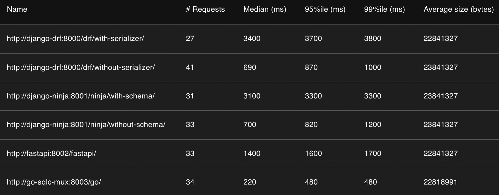

# API framework serialization performance

## Introduction
This project is to compare the performance of serialization between different API frameworks. 
The frameworks that are compared are:
- Django REST Framework
- Django Ninja
- FastAPI with Pydantic
- Golang with sqlc

Most of these are Python framworks, except Golang with sqlc. 
Using Golang with sqlc is a relatively barebones approach to building an API, it does not involve an ORM, 
and database records are serialized into native Go structs. 
It is expected to be fast, 
but I want to see just how close we can get to it from any of the Python frameworks listed above.

Django REST Framework is a heavy weight full-featured framework, there is a ton of tuning that could be done to it,
I wrote a step-by-step changes I have done to the Django REST Framework and Django Ninja examples to make them faster 
in the [related documentation](docs/readme.md).

## Methodology
A postgres database is used to store the data and shared between all the frameworks.
The database is dockerized, as well as each of the frameworks.
A dockerized Locust API load testing tool is also included to run the tests.
To ensure similar resource is available to each docker container during the tests, each Locust test is run sequentially,
so when one framework is handling a request, the others are idle.

## Quick Start
A set of makefile commands are provided:
```bash
make docker-build           // build the docker images
make docker-up              // start the docker containers
make django-drf-migrate     // using the Django REST Framework container to run set up database schema
make django-drf-populate    // using the Django REST Framework container to populate the database with 100k records
make docker-down            // stop the docker containers
```
Locust testing interface will be available on http://localhost:8089

I also included an api.http file so you can manually test the API client that is part of the JetBrains IDEs, 
or if you are using VS Code, the HttpYAC extension can be used.

## Results

